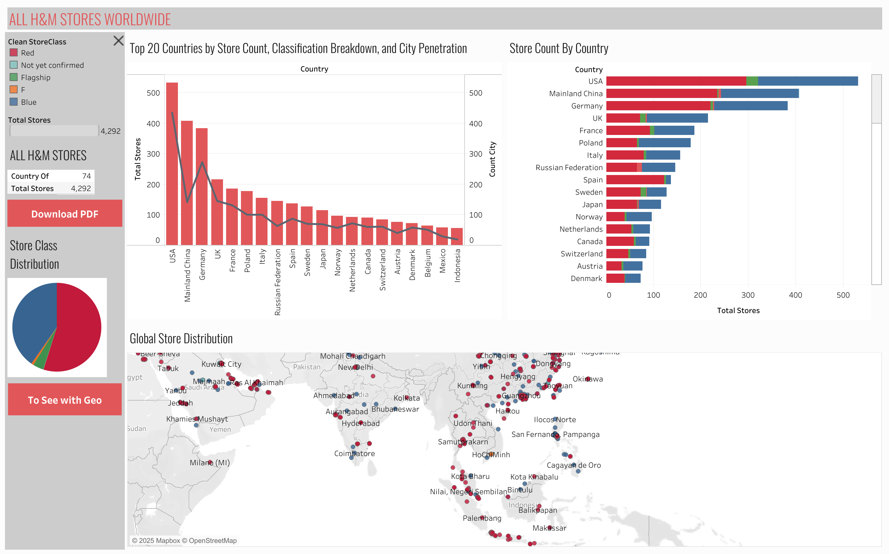

# Ilsan Hidayatulloh - Data Analyst Portfolio

## About Me

Hi, I'm Ilsan! I am an enthusiastic undergraduate student currently advancing into my **5th semester of Information Technology (IT)**. My IT background has given me a robust foundation in logic and problem-solving, which fuels my deep-seated passion for **Data Science and Data Analysis**.

I am driven to leverage my technical skills in **Python and SQL** to transform raw, complex data into clear, actionable business insights.

This repository serves as a space to showcase my abilities, share my end-to-end data analysis projects, and track my continuous growth in the data domain.

## Table of Contents

* [About Me](#about-me)
* [Portfolio Projects](#portfolio-projects)
* [Education](#education)
* [Certificates](#certificates)
* [Contact](#contact)

## Portfolio Projects

In this section, I list data analytics projects, detailing the goals, technology stack used, and key insights derived.

### Data Cleaning & Modeling (Python)

#### H&M Store Data Cleaning and Feature Engineering

* **Code:** [VIEW PYTHON CODE IN REPO](ALL_H&M_STORES_WORLDWIDE.ipynb)
* **Goal:** To prepare raw store data for advanced visualization, focusing on data quality, handling missing values, and creating the core analytic feature: `Clean StoreClass`.
* **Description:** Used Python (**Pandas**) to ingest raw data, perform necessary data validation, and address NULL values in the `StoreClass` column by reclassifying them as "Not yet confirmed." This script ensures data integrity and modeling readiness for Tableau.
* **Technology:** Python (Pandas).
* **Result (Output):** A clean, modeled dataset ready for visualization, forming the foundation of the market analysis.

### Data Visualization & Analysis (Tableau)

#### Global Store Network Analysis: Mapping H&M's Market Presence and Strategy

**Dashboard Preview:**

* **Dashboard File:** [CLICK TO DOWNLOAD WORKBOOK](ALL%20H&M%20STORES%20WORLDWIDE.twbx)
* **Goal:** To strategically analyze H&M's global store distribution by comparing store quantity, investment quality (*Store Class*), and market density (*City Penetration*).
* **Description:** Visualized the cleaned dataset in Tableau, featuring a Dual-Axis Chart to compare total stores with city spread across the TOP 20 countries, along with a Stacked Bar Chart for store classification breakdown.
* **Technology:** Tableau.
* **Key Findings:** The analysis reveals a dual strategy: **Flagship-led investment** in high-priority markets (US, China) and **high-density standard store deployment** in mature European markets.

## Education

* **Langlangbuana University:**  informatics engineering, 2023 – Current

## Certificates

The best way to showcase skills is by doing and sharing your job done, but sometimes certificates appear to be as an indirect result. Here are key certifications I've obtained, demonstrating my commitment to fundamental skills:

* **Data Science:** Menjadi Data Scientist (Dicoding) - [View Certificate](https://www.dicoding.com/dicodingassets/coursecertificate/a433259bb6ecc5a45a5a6d0b7f859f53f17b9538/view)
* **Python:** Memulai Pemrograman Dengan Python (Dicoding) - [View Certificate](https://www.dicoding.com/dicodingassets/coursecertificate/dc479dd3bfafd9d8d1e2fb528d46d501b00094e2/view)
* **SQL:**  Structured Query Language (SQL) (Dicoding) - [View Certificate](https://www.dicoding.com/dicodingassets/coursecertificate/bd1868b980384c33942f4f716b49672e7231206e/view)
* **Software Engineer:** [Certificate Into Software Engineer] - [View Certificate]([https://drive.google.com/drive/folders/1Ge7Y_uNUjMn1b1lDD0Y_sTaEmZFldbwx)](https://drive.google.com/file/d/1q5bWQSkuxcHv3tKJ_qqJPAlcrG41VWhl/view?usp=sharing)

## Contact

* **LinkedIn:** [ilsanhidayatulloh](https://www.linkedin.com/in/ilsan-hidayatuloh-084465288/)
* **Email:** hidayatullohilsan70@gmail.com
